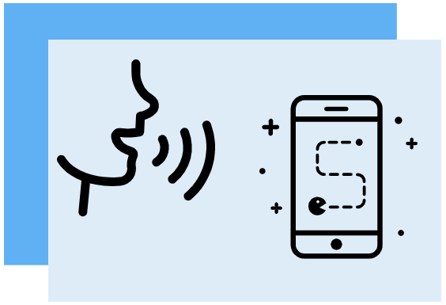

# Voice your Choice

## Description

Small Open Hack Prototype to experiment the current state of Web API about speech recognition.

[Live Demo](https://kefniark.github.io/voice-your-choice/assets/)



## 
* plan to do some web audio / plan to do some WebRPC
* at the end experiment the current state of Web API about speech recognition
    * speech > text
    * text > speech
* that's my demo

* you can access it and play with it, it's on github


## Conclusion

I managed to get something working but there are still lot of issues with those APIs:
* The quality of recognition doesnt seem to be super consistent
    * Score change quite a lot with just background noise
* Really slow, it takes between 1-3s to get the final result
    * It's possible to work with intermediate results, faster but they are even more inacurate :D
    * Seen some C library compiled to WASM on github, but haven't tested yet
* Browser implementation are far from good (example chrome ignore the `grammar` property)

I think their status "Experimental" is well deserved, and I don't recommend using them for real projects in their current state.

## Resources / Inspiration

* [Mozilla : Using the Web Speech API](https://developer.mozilla.org/en-US/docs/Web/API/Web_Speech_API/Using_the_Web_Speech_API)
* [Speech color changer](https://mdn.github.io/web-speech-api/speech-color-changer/)

## Usage

### Dev

```sh
npm install
npm run dev
```
